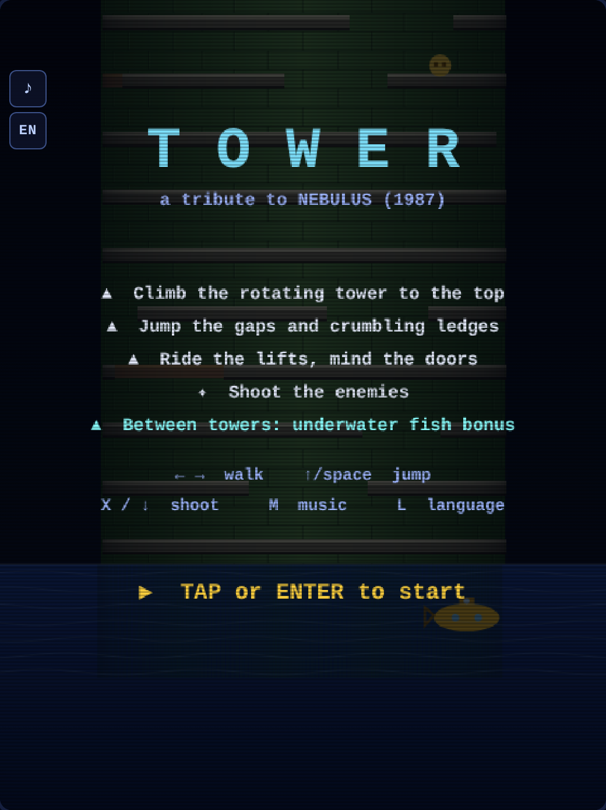
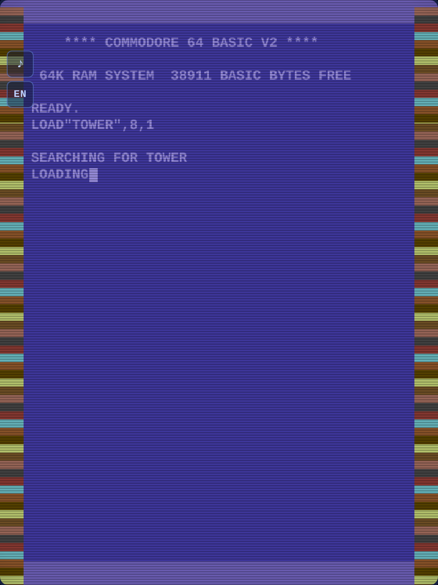
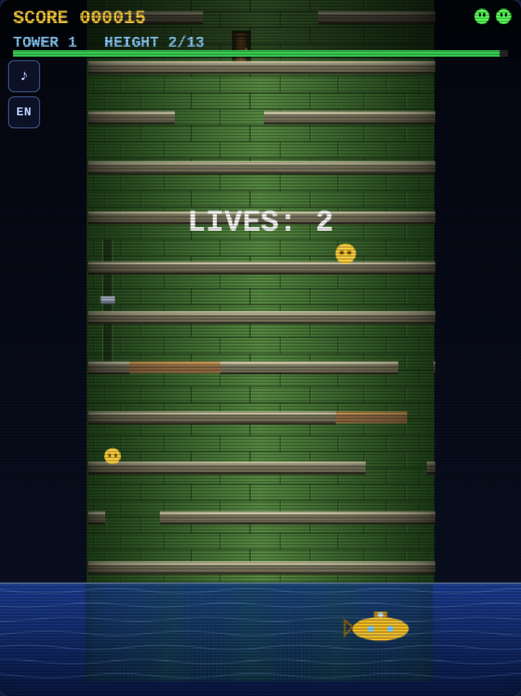
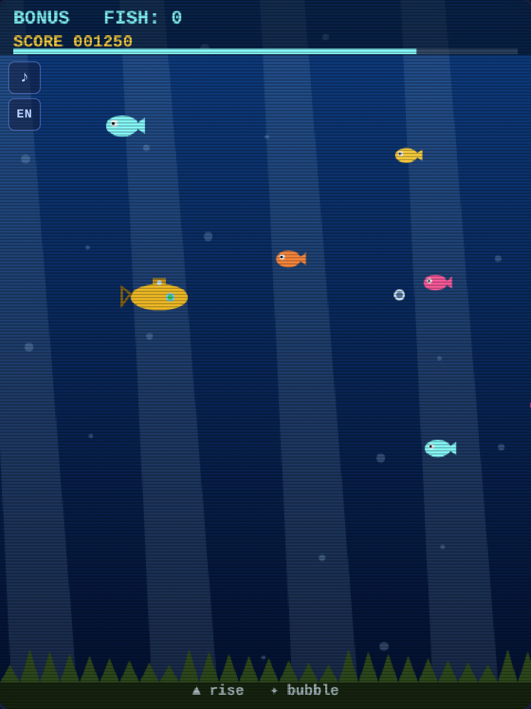

# TOWER — a tribute to Nebulus (1987)

A single-file browser game in the spirit of **Nebulus** (known in the US as *Tower Toppler*), the
Hewson classic from 1987 for the Commodore 64 and ZX Spectrum. You guide Pogo, a small green
creature, up a tower that rotates beneath his feet — leaping gaps, dodging enemies and racing a
timer to reach the battlements at the top.

Everything lives in one `index.html`. No build step, no dependencies, no network access. Open the
file in a browser and play.

**[▶ Play it here](https://ulebule.github.io/nebulus/)** *(enable GitHub Pages for this
repository to activate the link)*



## What it does

The tower is drawn as a shaded cylinder whose brickwork turns as you walk, which is the trick that
made the original memorable. Each tower gets its own colour scheme from an authentic C64-style
palette — green, blue, purple, orange, cyan, grey, red and brown — so the eight towers all look
distinct. Below the tower is the sea, with the tower's reflection wobbling on the surface, and above
it sits a castellated top with a goal flag.

Between towers Pogo travels by submarine, and that journey is a playable underwater bonus stage
where you catch or shoot fish for extra points. The game opens with a Commodore 64 boot sequence —
`LOAD"TOWER",8,1`, the tape-loader colour stripes and all — before the title screen appears.

| Loading | Tower | Bonus |
|---|---|---|
|  |  |  |

## Features

- **Rotating cylindrical tower** with per-tower C64 colour schemes and brick shading
- **Lifts** that carry you between floors, **doors** that open and close, and **unstable ledges**
  that crumble underfoot a moment after you step on them
- **Five enemy types**, one of which cannot be shot
- **Underwater bonus stage** between towers, piloting the submarine
- **C64 boot screen** with tape-loading stripes, and a chiptune soundtrack (square lead, triangle
  bass) with a separate theme for the bonus stage
- **Arcade hi-score table** shown at game over
- **Five languages**, picked automatically from the device language: English (default), Slovenian,
  German, Italian and French
- **Touch gestures and keyboard**, with a fallback to on-screen buttons

## Controls

On a keyboard, the arrow keys walk left and right, <kbd>↑</kbd> or <kbd>Space</kbd> jumps, and
<kbd>X</kbd> or <kbd>↓</kbd> shoots. <kbd>M</kbd> toggles the music and <kbd>L</kbd> cycles the
language.

On a touch screen you drag left or right to walk, swipe up to jump — the swipe ratchets, so you can
repeat it without lifting your finger — and tap to shoot. In the submarine the craft simply follows
your finger and a tap fires a bubble. The ✋ button in the corner switches to classic on-screen
buttons if you prefer them.

## Running it

Open `index.html` in any modern browser. That is the whole installation.

To serve it locally instead:

```bash
python3 -m http.server 8000
# then visit http://localhost:8000
```

To publish it, enable GitHub Pages for this repository (Settings → Pages → deploy from the `main`
branch, root folder). Because the game is a single self-contained file named `index.html`, it works
as a Pages site with no further configuration.

## Notes

The hi-score table lives in memory for as long as the page is open and resets on reload — the game
deliberately uses no browser storage.

This is an original implementation written from scratch as a homage. It shares no code or assets
with the 1987 game; Nebulus was created by John M. Phillips and published by Hewson Consultants.

## Install it

The game is a PWA: a browser will offer to add it to the home screen (on iOS,
Share → *Add to Home Screen*), and it then opens standalone, without browser
chrome. A service worker caches `index.html`, the manifest and the icons, so
after the first visit the game **runs with no connection at all**.

The worker only touches same-origin requests, and the cache key is prefixed
with the repo name — the other games published under `ulebule.github.io` keep
their own caches instead of evicting each other.

## License

MIT — see [LICENSE](LICENSE).
